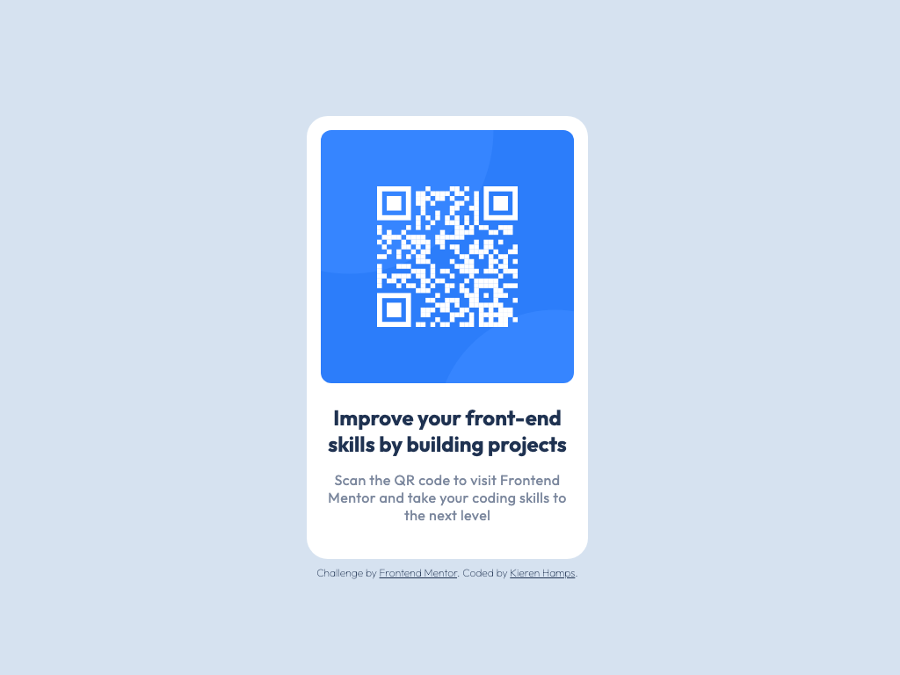

# Frontend Mentor - QR code component solution

<b><a href="https://www.frontendmentor.io/challenges/qr-code-component-iux_sIO_H">Challenge</a></b>

## **This Project**

This is my solution to the [QR code component challenge on Frontend Mentor](https://www.frontendmentor.io/challenges/qr-code-component-iux_sIO_H). Frontend Mentor challenges help you improve your coding skills by building realistic projects.

## **Built with**

- Semantic HTML5 markup
- Mobile-first workflow
- Flexbox
- [Tailwind CSS](https://tailwindcss.com/) - For styling
- [Vite](https://vitejs.dev/) - For live dev server

## **Useful resources**

- [Tailwind CSS Docs](https://v1.tailwindcss.com/docs/) - Documentation from Tailwind CSS is a great reference.

## **Acknowledgments**

A nice introduction into [Frontend Mentor](https://www.frontendmentor.io) for anyone wanting to develop thier frontend skills.
